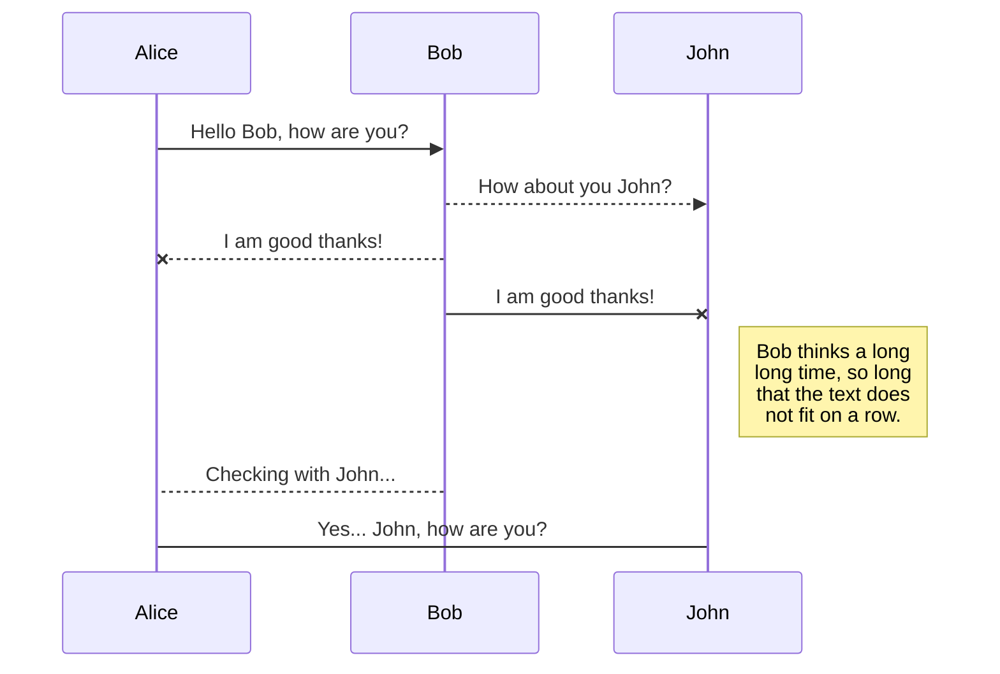
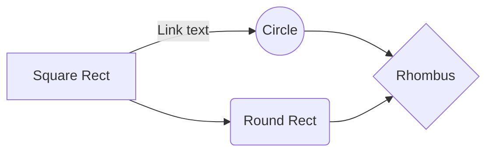

# Alibaba Cloud VPC와 AWS VPC를 VPN으로 연결하기 (IPsec VPN Connection / Site-to-site VPN Connection)

## 1. 배경 설명

많은  기업들은  목적에  따라  다양한  종류의  Public Cloud를  사용하고  있습니다.

이는  사업의  형태  및  목적성에  따라  Alibaba Cloud 혹은  그  외의  Cloud를  혼용하여  사용하기도  하며  Vendor Lock-in 해제의  목적에  따라  같은  국가에  두개  이상의  Cloud 환경을  이용하기도  합니다.

본  시나리오는  고객이  이기종의  Cloud 환경을  안전하게  연결할  수  있는  VPN Connection에  대한  내용을  담았습니다.

특히  Alibaba Cloud의  고객  중  케이스가  많은  **중국의  Alibaba Cloud VPC – 한국의  AWS VPC를  연결하는  시나리오**에  대해서  해당  내용을  참조할  수  있습니다.

## 2. Solution Overview

예시  환경은  중국  Shanghai Region의  Alibaba Cloud VPC 환경과  한국  Central Region의  AWS VPC환경을  VPN (IPsec VPN Connection / Site-to-site VPN Connection) 으로  연결합니다.

## 3. 사전  준비

- [Alibaba Cloud VPN Gateway](https://www.alibabacloud.com/help/doc-detail/64960.htm?spm=a2c63.l28256.b99.5.5d6ae889hLNiHt)

- [AWS Virtual Private Gateway](https://docs.aws.amazon.com/ko_kr/vpn/latest/s2svpn/how_it_works.html)

## 4. Main Steps

**[Alibaba Cloud Side]**
### 4.1 VPC 생성
VPC를  생성합니다. 사용할  이름과  IPv4 CIDR Block을  설정합니다.
> VPC는  퍼블릭  클라우드에서  사용할  전용  가상  네트워크입니다. 설정된  IPv4 CIDR Block은  Private Network으로  사용할  구간으로  이해할  수  있습니다.

### 4.2 VPN 생성
VPN Gateway를  구매합니다. 본  시나리오에서는  Shanghai Region에  생성했습니다.
> VPN은  Site to Site환경에서  통신  내용을  바깥  사람에게  드러내지  않고  통신할  목적으로  쓰이는  사설  통신망입니다. 이  환경에서  VPN Gateway는  Alibaba Cloud VPC 환경에  들어올  문으로  이해할  수  있습니다.

### 

## Delete a file

You can delete the current file by clicking the **Remove** button in the file explorer. The file will be moved into the **Trash** folder and automatically deleted after 7 days of inactivity.

## Export a file

You can export the current file by clicking **Export to disk** in the menu. You can choose to export the file as plain Markdown, as HTML using a Handlebars template or as a PDF.

# Synchronization

Synchronization is one of the biggest features of StackEdit. It enables you to synchronize any file in your workspace with other files stored in your **Google Drive**, your **Dropbox** and your **GitHub** accounts. This allows you to keep writing on other devices, collaborate with people you share the file with, integrate easily into your workflow... The synchronization mechanism takes place every minute in the background, downloading, merging, and uploading file modifications.

There are two types of synchronization and they can complement each other:

- The workspace synchronization will sync all your files, folders and settings automatically. This will allow you to fetch your workspace on any other device.
	> To start syncing your workspace, just sign in with Google in the menu.

- The file synchronization will keep one file of the workspace synced with one or multiple files in **Google Drive**, **Dropbox** or **GitHub**.
	> Before starting to sync files, you must link an account in the **Synchronize** sub-menu.

## Open a file

You can open a file from **Google Drive**, **Dropbox** or **GitHub** by opening the **Synchronize** sub-menu and clicking **Open from**. Once opened in the workspace, any modification in the file will be automatically synced.

## Save a file

You can save any file of the workspace to **Google Drive**, **Dropbox** or **GitHub** by opening the **Synchronize** sub-menu and clicking **Save on**. Even if a file in the workspace is already synced, you can save it to another location. StackEdit can sync one file with multiple locations and accounts.

## Synchronize a file

Once your file is linked to a synchronized location, StackEdit will periodically synchronize it by downloading/uploading any modification. A merge will be performed if necessary and conflicts will be resolved.

If you just have modified your file and you want to force syncing, click the **Synchronize now** button in the navigation bar.

> **Note:** The **Synchronize now** button is disabled if you have no file to synchronize.

## Manage file synchronization

Since one file can be synced with multiple locations, you can list and manage synchronized locations by clicking **File synchronization** in the **Synchronize** sub-menu. This allows you to list and remove synchronized locations that are linked to your file.

# Publication

Publishing in StackEdit makes it simple for you to publish online your files. Once you're happy with a file, you can publish it to different hosting platforms like **Blogger**, **Dropbox**, **Gist**, **GitHub**, **Google Drive**, **WordPress** and **Zendesk**. With [Handlebars templates](http://handlebarsjs.com/), you have full control over what you export.

> Before starting to publish, you must link an account in the **Publish** sub-menu.

## Publish a File

You can publish your file by opening the **Publish** sub-menu and by clicking **Publish to**. For some locations, you can choose between the following formats:

- Markdown: publish the Markdown text on a website that can interpret it (**GitHub** for instance),
- HTML: publish the file converted to HTML via a Handlebars template (on a blog for example).

## Update a publication

After publishing, StackEdit keeps your file linked to that publication which makes it easy for you to re-publish it. Once you have modified your file and you want to update your publication, click on the **Publish now** button in the navigation bar.

> **Note:** The **Publish now** button is disabled if your file has not been published yet.

## Manage file publication

Since one file can be published to multiple locations, you can list and manage publish locations by clicking **File publication** in the **Publish** sub-menu. This allows you to list and remove publication locations that are linked to your file.

# Markdown extensions

StackEdit extends the standard Markdown syntax by adding extra **Markdown extensions**, providing you with some nice features.

> **ProTip:** You can disable any **Markdown extension** in the **File properties** dialog.

## SmartyPants

SmartyPants converts ASCII punctuation characters into "smart" typographic punctuation HTML entities. For example:

|                |ASCII                          |HTML                         |
|----------------|-------------------------------|-----------------------------|
|Single backticks|`'Isn't this fun?'`            |'Isn't this fun?'            |
|Quotes          |`"Isn't this fun?"`            |"Isn't this fun?"            |
|Dashes          |`-- is en-dash, --- is em-dash`|-- is en-dash, --- is em-dash|

## KaTeX

You can render LaTeX mathematical expressions using [KaTeX](https://khan.github.io/KaTeX/):

The *Gamma function* satisfying $\Gamma(n) = (n-1)!\quad\forall n\in\mathbb N$ is via the Euler integral

$$
\Gamma(z) = \int_0^\infty t^{z-1}e^{-t}dt\,.
$$

> You can find more information about **LaTeX** mathematical expressions [here](http://meta.math.stackexchange.com/questions/5020/mathjax-basic-tutorial-and-quick-reference).

## UML diagrams

You can render UML diagrams using [Mermaid](https://mermaidjs.github.io/). For example, this will produce a sequence diagram:

And this will produce a flow chart:

<!--stackedit_data:
eyJoaXN0b3J5IjpbMTY5Mzk2NDI1NywtMTU5NzQ0NjEwNCwtMj
U4MjkyNzE1LC0zMDkwMjcxMzksLTg1ODU5NDc2NCwtMjAzMTEy
MjY3OSwxNDExMjQ4NTU1LC0zMDkwMjcxMzksMTQxMTI0ODU1NV
19
-->