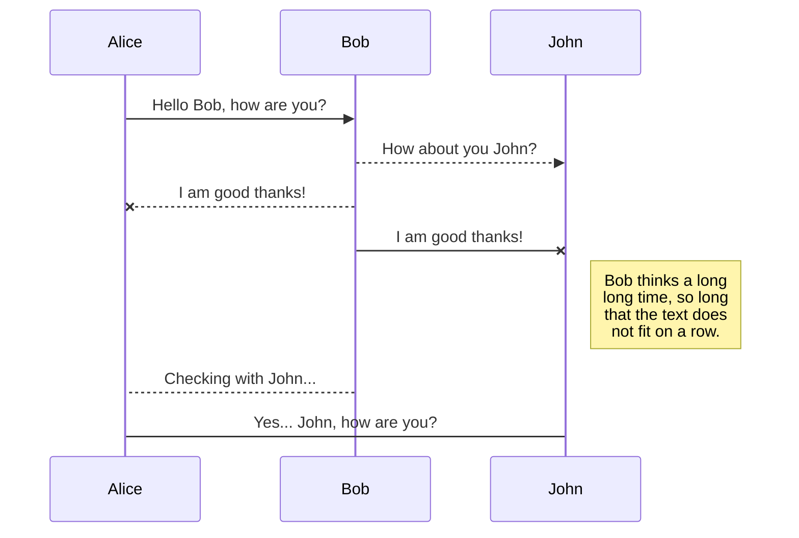
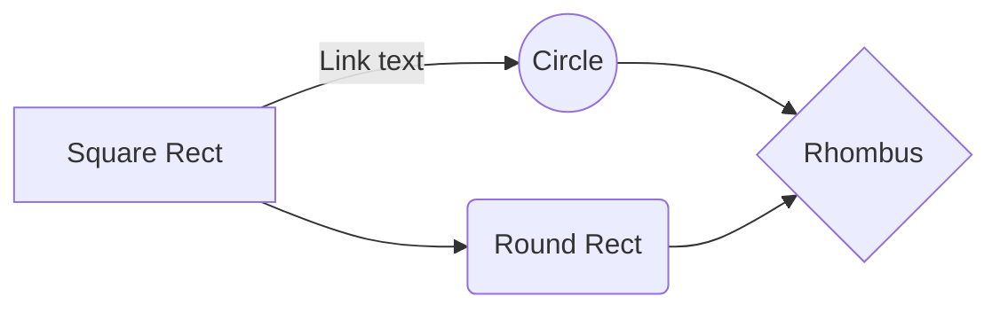

# Redis shake migration test

Redis shake는 알리바바에서 개발하는 오픈소스 마이그레이션 툴이다. 본 테스트는 redis 마이그레이션을 위해 수행했지만 redis 뿐만 아니라 mongodb도 지원한다. 

# 테스트 목적
테스트를 진행한 이유는 고객이 알리바바 클라우드 China console에서 International console로 마이그레이션을 하는데 다운타임을 적게 가져가고 싶어 해서다. 레디스를 온라인 상 마이그레이션하는 방법은 다음과 같다.

- DTS(Data Transmission Service): Source/Target 모두 Redis Cluster Edition을 지원하지만 어카운트 간 마이그레이션은 지원하지 않는다. 

	테스트 차 Target instance type을 User-Created Database Connected Over Express Connect ---" 로 해보았으나 연결은 되지 않았다. 수 차례 테스트 결과 단순히 두 VPC간 마이그레이션과는 다르게 RAM 계정에서의  적절한 권한을 주고 target instance에서 DTS private IP list를 whitelist에 넣어주는 등의 작업이 필요하다. 그 작업을 다 해도 결국 연결은 되지 않았다. 

	결론은.. DTS가 account간 마이그레이션을 지원할 때까지 기다려야 한다. 당장은 지원 예정에 없다. 

	

- Redis Shake를 통한 마이그레이션 
sync mode와 rump모드가 있고 sync mode로 이관 시 온라인 마이그레이션이 가능하다. 하지만 현재 sync mode에서 Apsara redis cluster edition DB를 지원하지 않는다.

따라서 본 테스트는 redis cluster이 얼마만큼 간단하고 빠르게 수행되는지, online migration을 위한 incremental migration이 진행되는지를 확인하는 것이 목적이다. 

# 테스트 환경
- Source DB: 
	- Region: China (Hong Kong)
	- Zone: Hong Kong MZone1 B+C
	- Redis version: 4.0
	- Architecture Type: Cluster
	- Instance Class: 1G (2 shards with 2 replicas)
	- Package Type: Standard Package
	- Account: Aliyun (China Cloud Account)
- Target DB
	- Region: China (Hong Kong)
	- Zone: Hong Kong MZone1 B+C
	- Redis version: 4.0
	- Architecture Type: Cluster
	- Instance Class: 1G (2 shards with 2 replicas)
	- Package Type: Standard Package
	- Account: International account
- NW configuration
	
# 테스트 시나리오
1. Redis Shake with "sync" mode 
	- Online 상 마이그레이션 가능
	- 현재 Redis Cluster Edition은 소스로 지원하지 않는다. 하지만 테스트 차 돌려보았다.
2. Redis Shake with "rump" mode
	- Data consistency를 위해 DB 중단 후 사용하는 것이 좋음. 즉 오프라인 마이그레이션 용
	- 럼프 모드에서 redis-shake는 SCAN 모드의 소스 Redis에서 전체 데이터 양을 가져 와서 대상에 쓰고 데이터 마이그레이션을 구현함. 이 마이그레이션 방법은 SYNC 또는 PSYNC를 사용하지 않으며 Redis 서비스 성능에 거의 영향을 미치지 않는다. Redis 클러스터를 지원하는데 이는 클라우드 DB든, 자체 구축 DB든 모두 지원한다. 
	- 럼프 모드는 버전 2.8 인스턴스를 버전 4.0 인스턴스로 마이그레이션하는 것과 같이 버전 간 마이그레이션을 지원함.
	- redis-shake에 대한 자세한 내용은 [redis-shake Github 홈페이지](https://github.com/aliyun/redis-shake?spm=a2c4g.11186623.2.10.10776f10RwLL6e) 또는 [FAQ](https://github.com/alibaba/RedisShake/wiki/%E7%AC%AC%E4%B8%80%E6%AC%A1%E4%BD%BF%E7%94%A8%EF%BC%8C%E5%A6%82%E4%BD%95%E8%BF%9B%E8%A1%8C%E9%85%8D%E7%BD%AE%EF%BC%9F?spm=a2c4g.11186623.2.11.10776f10RwLL6e)를 참조하십시오.

# 테스트 내용
1. Redis Shake with "sync" mode
souce.type 에 proxy를 지정해야 하는데(Apsara Redis가 proxy 구성이기 때문) proxy는 현재 rump mode에서만 지원가능하다는 에러가 나옴. 따라서 해당 기능이 제공되는 새로운 버전이 나올 때 까지 기다려야 함. 
2. Redis Shake with "rump" mode

	설정 방법은 [aliyun documentation]([https://help.aliyun.com/document_detail/117311.html?spm=a2c4g.11186623.6.699.33f57892h0NAy9](https://help.aliyun.com/document_detail/117311.html?spm=a2c4g.11186623.6.699.33f57892h0NAy9))과 [github - how to setup]([https://github.com/alibaba/RedisShake/wiki/tutorial-about-how-to-set-up#32-example-cluster-to-cluster-sync](https://github.com/alibaba/RedisShake/wiki/tutorial-about-how-to-set-up#32-example-cluster-to-cluster-sync))을 참고했다.

# Files

StackEdit stores your files in your browser, which means all your files are automatically saved locally and are accessible **offline!**

## Create files and folders

The file explorer is accessible using the button in left corner of the navigation bar. You can create a new file by clicking the **New file** button in the file explorer. You can also create folders by clicking the **New folder** button.

## Switch to another file

All your files and folders are presented as a tree in the file explorer. You can switch from one to another by clicking a file in the tree.

## Rename a file

You can rename the current file by clicking the file name in the navigation bar or by clicking the **Rename** button in the file explorer.

## Delete a file

You can delete the current file by clicking the **Remove** button in the file explorer. The file will be moved into the **Trash** folder and automatically deleted after 7 days of inactivity.

## Export a file

You can export the current file by clicking **Export to disk** in the menu. You can choose to export the file as plain Markdown, as HTML using a Handlebars template or as a PDF.

# Synchronization

Synchronization is one of the biggest features of StackEdit. It enables you to synchronize any file in your workspace with other files stored in your **Google Drive**, your **Dropbox** and your **GitHub** accounts. This allows you to keep writing on other devices, collaborate with people you share the file with, integrate easily into your workflow... The synchronization mechanism takes place every minute in the background, downloading, merging, and uploading file modifications.

There are two types of synchronization and they can complement each other:

- The workspace synchronization will sync all your files, folders and settings automatically. This will allow you to fetch your workspace on any other device.
	> To start syncing your workspace, just sign in with Google in the menu.

- The file synchronization will keep one file of the workspace synced with one or multiple files in **Google Drive**, **Dropbox** or **GitHub**.
	> Before starting to sync files, you must link an account in the **Synchronize** sub-menu.

## Open a file

You can open a file from **Google Drive**, **Dropbox** or **GitHub** by opening the **Synchronize** sub-menu and clicking **Open from**. Once opened in the workspace, any modification in the file will be automatically synced.

## Save a file

You can save any file of the workspace to **Google Drive**, **Dropbox** or **GitHub** by opening the **Synchronize** sub-menu and clicking **Save on**. Even if a file in the workspace is already synced, you can save it to another location. StackEdit can sync one file with multiple locations and accounts.

## Synchronize a file

Once your file is linked to a synchronized location, StackEdit will periodically synchronize it by downloading/uploading any modification. A merge will be performed if necessary and conflicts will be resolved.

If you just have modified your file and you want to force syncing, click the **Synchronize now** button in the navigation bar.

> **Note:** The **Synchronize now** button is disabled if you have no file to synchronize.

## Manage file synchronization

Since one file can be synced with multiple locations, you can list and manage synchronized locations by clicking **File synchronization** in the **Synchronize** sub-menu. This allows you to list and remove synchronized locations that are linked to your file.

# Publication

Publishing in StackEdit makes it simple for you to publish online your files. Once you're happy with a file, you can publish it to different hosting platforms like **Blogger**, **Dropbox**, **Gist**, **GitHub**, **Google Drive**, **WordPress** and **Zendesk**. With [Handlebars templates](http://handlebarsjs.com/), you have full control over what you export.

> Before starting to publish, you must link an account in the **Publish** sub-menu.

## Publish a File

You can publish your file by opening the **Publish** sub-menu and by clicking **Publish to**. For some locations, you can choose between the following formats:

- Markdown: publish the Markdown text on a website that can interpret it (**GitHub** for instance),
- HTML: publish the file converted to HTML via a Handlebars template (on a blog for example).

## Update a publication

After publishing, StackEdit keeps your file linked to that publication which makes it easy for you to re-publish it. Once you have modified your file and you want to update your publication, click on the **Publish now** button in the navigation bar.

> **Note:** The **Publish now** button is disabled if your file has not been published yet.

## Manage file publication

Since one file can be published to multiple locations, you can list and manage publish locations by clicking **File publication** in the **Publish** sub-menu. This allows you to list and remove publication locations that are linked to your file.

# Markdown extensions

StackEdit extends the standard Markdown syntax by adding extra **Markdown extensions**, providing you with some nice features.

> **ProTip:** You can disable any **Markdown extension** in the **File properties** dialog.

## SmartyPants

SmartyPants converts ASCII punctuation characters into "smart" typographic punctuation HTML entities. For example:

|                |ASCII                          |HTML                         |
|----------------|-------------------------------|-----------------------------|
|Single backticks|`'Isn't this fun?'`            |'Isn't this fun?'            |
|Quotes          |`"Isn't this fun?"`            |"Isn't this fun?"            |
|Dashes          |`-- is en-dash, --- is em-dash`|-- is en-dash, --- is em-dash|

## KaTeX

You can render LaTeX mathematical expressions using [KaTeX](https://khan.github.io/KaTeX/):

The *Gamma function* satisfying $\Gamma(n) = (n-1)!\quad\forall n\in\mathbb N$ is via the Euler integral

$$
\Gamma(z) = \int_0^\infty t^{z-1}e^{-t}dt\,.
$$

> You can find more information about **LaTeX** mathematical expressions [here](http://meta.math.stackexchange.com/questions/5020/mathjax-basic-tutorial-and-quick-reference).

## UML diagrams

You can render UML diagrams using [Mermaid](https://mermaidjs.github.io/). For example, this will produce a sequence diagram:

And this will produce a flow chart:

<!--stackedit_data:
eyJoaXN0b3J5IjpbMzkzMzcwNjE3LDg1NDQ4ODMzLC01NjM5OD
UyMDZdfQ==
-->