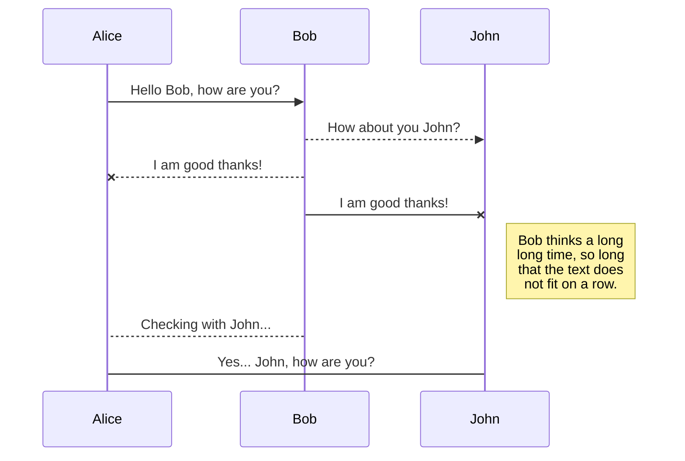
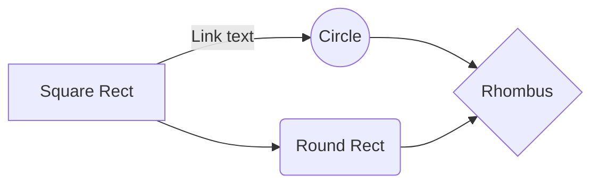

# SaaS acceleration for Korea: SAG + CEN + GA (for bidirectional, KR to CN and CN to KR)

# 1. background
Many multinational enterprises use SaaS services deployed overseas, such as Office365 and Salesforce. Due to the poor quality of China domestic visits to overseas sites, the customer experience is badly affected.

This solution uses smart Access Gateway SAG, CEN and GA1.0 to build an application acceleration service, which can help domestic users in China accelerate access to application systems deployed overseas.

# 2. Solution Overview
## 2.1 Overview


To accelerate the Korea MS teams service as an example, we have 5 main parts:
1. Client: SAG-APP is Alibaba Cloud SD-WAN client software that can be installed on Android, iOS, Windows, MacOS and other systems. SAG-APP can be connected to the nearest access point(PoP) of the CCN network.
2. CCN: CCN is Alibaba Cloud SD-WAN access network, which consists of access points all over the country. It can quickly connect SAG terminals to Alibaba Cloud backbone networks.
3. CEN: CEN is a global virtual enterprise network. Relying on Alibaba Cloud global backbone network, it provides high-quality global networking services for enterprise customers.
4. Proxy server: As a forward proxy and SNAT, it has two different functions to forward the traffic. It acts as a L4 proxy  helped from the upper layer to extract the domain name and acts as a SNAT to access public internet through GAIP.
5. GA1.0: Backed by the Alibaba Cloud backbone network, GA provides a high-speed network experience and ultra-low transmission latency between China and Korea.

## 2.2 Acceleration Principle

This solution can accelerate HTTP/HTTPs based on the domain name.

1. The client configures the DNS address of the Private Zone. The custom DNS function of the SAG-APP allows you to configure the DNS of the terminal to Private Zone DNS. 

Private Zone DNS addresses are 100.100.2.136 and 100.100.2.138

2. Use the Private Zone to resolve the domain name to be accelerated into the internal IP address of the proxy server. If the domain does not exist in Private Zone, the SAG client then lookup public DNS to reach the target server. In this way, we only accelerate teams related domains.
3. The traffic to be accelerated is forwarded to the proxy server via CCN and CEN. The proxy server then send the request to the MS teams service through the local Korea internet.
4. Traffic that does not need to be accelerated is not pulled to CCN, and is directly accessed from the local internet of the client, without occupying SAG-APP acceleration bandwidth.

# 3. Prerequisites
As of now(2021.02.16), Alibaba Cloud do not have a Korea region. For having every component be in Alibaba Cloud, we use an old version of GA(Global Accelerator). We can use a current version of GA, but then we need to deploy a proxy in somewhere in Korea by using other cloud vendors or IDC etc, which leads to become cumbersome to manage entire components. To be able to use old version of GA(GA1.0), you need to submit the ticket and apply a whitelist. Make sure that you apply all of them below.
	1) GA1.0
	2) Korea(Seoul) Network PoP for an accelerated area
	3) A VPC whitelist for Korea Network PoP

# 4. Main steps


## 4.1 create a VPC/CEN/CCN
In this step, the basic network architecture on which the entire service depends is built. 

### 4.1.1 create a VPC
In this scenario, we need to create 2 VPC.
|   VPC name       |usage                          |Region     |     Address segment  |
|----------------|-------------------------------|-----------------------------|----|
|Proxy_VPC|Deploy forward proxy services|Shanghai (can be the other region depending on your needs)| 10.0.0.0/8
|PVZ_VPC|The domain name associated with the PrivateZone.|Shanghai|172.19.0.0/16

Which Proxy-VPC can be created in 2 different AZ the vSwitch for easy deployment High available agent cluster. You do not need to deploy any resources in the PVZ-VPC. You can also use any existing domestic VPC without any conflict with the PrivateZone configuration.

### 4.1.2 create a CEN
Create a CEN instance named SF_Accelerate_CEN.

For more information, see:
https://www.alibabacloud.com/help/doc-detail/128625.htm?spm=a2c63.l28256.b99.21.28856ee1KV3iAr

Add the previously created Proxy_VPC and PVZ_VPC to CEN.

For detailed operation steps, see:
https://www.alibabacloud.com/help/doc-detail/128653.htm?spm=a2c63.p38356.b99.22.a6d216b0iUTv2R

### 4.1.3 create a CCN
Create a CCN instance for SAG-APP access and name it SF_Accelerate_CCN.

The steps to create CCN are detailed in:
https://www.alibabacloud.com/help/doc-detail/93669.htm?spm=a2c63.p38356.b99.84.3ca863f2I8DgK7

After the CCN is created, bind the CCN to SF_Accelerate_CEN. For more information, see:
https://www.alibabacloud.com/help/doc-detail/93671.htm?spm=a2c63.p38356.b99.83.6b3e72e6tMfBFd

## 4.2 Create proxy ECS, GA and bind a backend ECS
In this step, we will create a proxy instance in Proxy_VPC in Shanghai as an exit for service access.

### 4.2.1 Create a proxy ECS instance
The following is an example of an ECS instance:


Where:
1.  Configure the Internet bandwidth as needed;
2.  The security group needs to release TCP80 and TCP443 ports;
3.  The instance type can be configured as needed;
4.  According to the HA need, you can create create two different ECS in different zones and use SLB to forward the traffic to backend ECS. Here I only create a single instance.


### 4.2.2 Create a GA instance
If your whitelist (see in the prerequisites section) is successfully applied, you would see the Global Accelerator in VPC console.


Select the region 'Asia Pacific NE 2 pop (Seoul)'.


Select the 'Dedicated Bandwidth' and the 'create instance' button. 


Select the same as the figure below and complete purchasing.


### 4.2.2 Bind the backend instance
Now you can see the GA instance just created. Make sure that you choose the region 'Asia Pacific NE 2 pop (Seoul)', otherwise you can not see anything in the console.
Click the 'Bind instance' button.


Choose the ECS instance previously created.


Now you can see the backend service instance IP address. Copy this address to keep it.


### 4.2.3 Activate the backend service
After the backend service is bound, you need to add a NIC sub interface to the bound ECS instance. The IP address of the sub interface is the backend service address allocated by the system. After the backend service is bound to the Global Acceleration instance, the acceleration link is always active as long as the sub interface in the backend server is correctly configured.

> Note: Activation is required only when the backend service is an ECS instance.

1. Access the proxy ECS. 
2. Run the following command to open the NIC configuration file.
	```
	sudo vi /etc/sysconfig/network-scripts/ifcfg-eth0:1
	```
3. Add the following information in the configuration file. Change the IPADDR to your own copied address from previous section.
	```
	DEVICE=eth0:1
	 IPADDR=10.0.0.124
	 NETMASK=255.255.255.255
	 ONBOOT=yes
	```
4. Run the following command to make the configuration take effect.
	```
	ifup eth0:1
	```
5. Verification

	After the backend service is bound, you can ping the EIP of the Global Acceleration instance to verify if the configuration takes effect. 

## 4.3 configure proxy service
### 4.3.1 configure a forward proxy using nginx
Log in to the proxy ECS and run the following command after root logon:
```
curl https://network-scripts.oss-cn-shanghai.aliyuncs.com/proxy-scripts/install-proxy.sh|bash
```
If you want to see how the forward proxy works through **ngx_stream_ssl_preread_module** in nginx, reach the following blog to understand how this L4 proxy extract the domain name from the upper-layer packets to obtain the target domain name. (in this case, teams related domains)
https://www.alibabacloud.com/blog/how-to-use-nginx-as-an-https-forward-proxy-server_595799#

### 4.3.2 configure SNAT 
1. log in to the proxy ECS server via SSH and enable IP forwarding:
	```
	echo "net.ipv4.ip_forward = 1" >> /etc/sysctl.conf
	sysctl -p
	```

2. Install and configure the iptables SNAT rules. 
	```
	yum -y install iptables-services
	systemctl start iptables       
	systemctl enable iptables  
   # snat rule, dns resolve to eth0, and using eth0:1 as source to access internet
  iptables -t nat -A POSTROUTING -s 10.0.0.122 -o eth0 -j SNAT --to-source 10.0.0.124
	```
	

There are two types of synchronization and they can complement each other:

- The workspace synchronization will sync all your files, folders and settings automatically. This will allow you to fetch your workspace on any other device.
	> To start syncing your workspace, just sign in with Google in the menu.

- The file synchronization will keep one file of the workspace synced with one or multiple files in **Google Drive**, **Dropbox** or **GitHub**.
	> Before starting to sync files, you must link an account in the **Synchronize** sub-menu.

## Open a file

You can open a file from **Google Drive**, **Dropbox** or **GitHub** by opening the **Synchronize** sub-menu and clicking **Open from**. Once opened in the workspace, any modification in the file will be automatically synced.

## Save a file

You can save any file of the workspace to **Google Drive**, **Dropbox** or **GitHub** by opening the **Synchronize** sub-menu and clicking **Save on**. Even if a file in the workspace is already synced, you can save it to another location. StackEdit can sync one file with multiple locations and accounts.

## Synchronize a file

Once your file is linked to a synchronized location, StackEdit will periodically synchronize it by downloading/uploading any modification. A merge will be performed if necessary and conflicts will be resolved.

If you just have modified your file and you want to force syncing, click the **Synchronize now** button in the navigation bar.

> **Note:** The **Synchronize now** button is disabled if you have no file to synchronize.

## Manage file synchronization

Since one file can be synced with multiple locations, you can list and manage synchronized locations by clicking **File synchronization** in the **Synchronize** sub-menu. This allows you to list and remove synchronized locations that are linked to your file.


# Publication

Publishing in StackEdit makes it simple for you to publish online your files. Once you're happy with a file, you can publish it to different hosting platforms like **Blogger**, **Dropbox**, **Gist**, **GitHub**, **Google Drive**, **WordPress** and **Zendesk**. With [Handlebars templates](http://handlebarsjs.com/), you have full control over what you export.

> Before starting to publish, you must link an account in the **Publish** sub-menu.

## Publish a File

You can publish your file by opening the **Publish** sub-menu and by clicking **Publish to**. For some locations, you can choose between the following formats:

- Markdown: publish the Markdown text on a website that can interpret it (**GitHub** for instance),
- HTML: publish the file converted to HTML via a Handlebars template (on a blog for example).

## Update a publication

After publishing, StackEdit keeps your file linked to that publication which makes it easy for you to re-publish it. Once you have modified your file and you want to update your publication, click on the **Publish now** button in the navigation bar.

> **Note:** The **Publish now** button is disabled if your file has not been published yet.

## Manage file publication

Since one file can be published to multiple locations, you can list and manage publish locations by clicking **File publication** in the **Publish** sub-menu. This allows you to list and remove publication locations that are linked to your file.


# Markdown extensions

StackEdit extends the standard Markdown syntax by adding extra **Markdown extensions**, providing you with some nice features.

> **ProTip:** You can disable any **Markdown extension** in the **File properties** dialog.


## SmartyPants

SmartyPants converts ASCII punctuation characters into "smart" typographic punctuation HTML entities. For example:

|   VPC name       |usage                          |Region     |     Address segment  |
|----------------|-------------------------------|-----------------------------|----|
|Proxy_VPC|Deploy forward proxy services|Shanghai (can be the other region depending on your needs)| 10.0.0.0/8
|PVZ_VPC|The domain name associated with the PrivateZone.|Shanghai|172.19.0.0/16
Which Proxy-VPC can be created in 2 different AZ the vSwitch for easy deployment High available agent cluster. You do not need to deploy any resources in the PVZ-VPC. You can also use any existing domestic VPC without any conflict with the PrivateZone configuration.

## 4.

You can render LaTeX mathematical expressions using [KaTeX](https://khan.github.io/KaTeX/):

The *Gamma function* satisfying $\Gamma(n) = (n-1)!\quad\forall n\in\mathbb N$ is via the Euler integral

$$
\Gamma(z) = \int_0^\infty t^{z-1}e^{-t}dt\,.
$$

> You can find more information about **LaTeX** mathematical expressions [here](http://meta.math.stackexchange.com/questions/5020/mathjax-basic-tutorial-and-quick-reference).


## UML diagrams

You can render UML diagrams using [Mermaid](https://mermaidjs.github.io/). For example, this will produce a sequence diagram:



And this will produce a flow chart:


<!--stackedit_data:
eyJoaXN0b3J5IjpbNTU3MTA1OTY4LC0yNDc4OTA2NDEsLTE5Nz
IzNjgzNSwxNzEyMjcxMjIwLDE4MTk1MzU2MTksLTIwODAxMzI0
MzddfQ==
-->