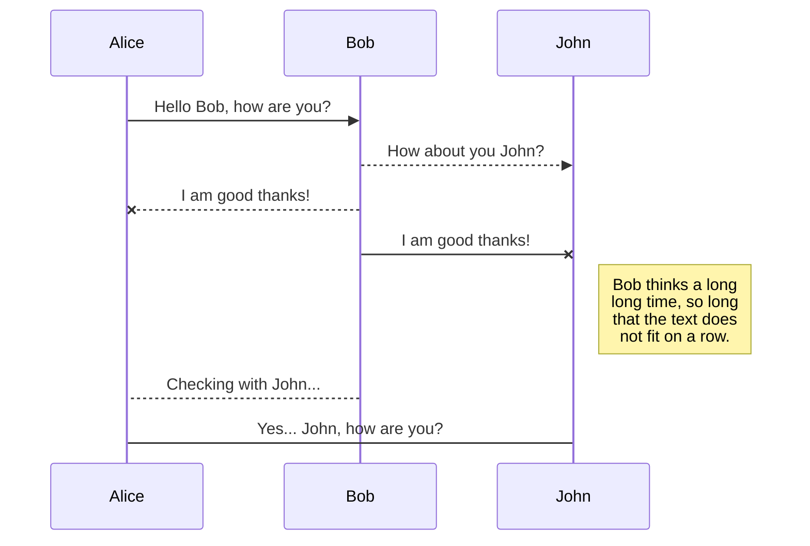
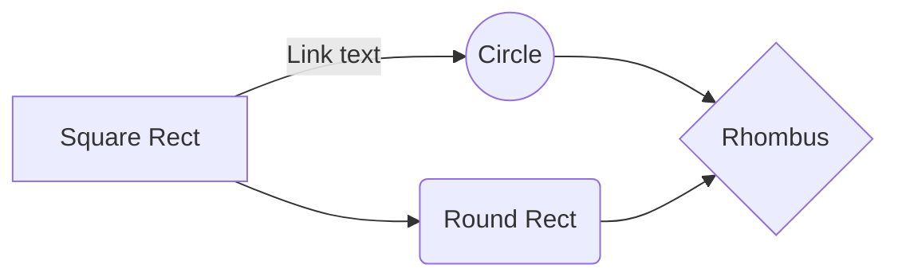

# SSH connection acceleration with GA including ACL

As of 2020.07.05, there is no feature that control ACL(Access Control List) in Global Accelerator(GA).(BTW This feature is planned to be published on 2020.10) However, if we think of working on server via ssh, we typically allow only specific fixed IP range to which IT team belongs or use bastion server for security reasons. Here we will discuss how we can use GA to accelerate ssh traffic between China and Korea and setup firewall rule based on client IP address at the same time.

## Test scenario
1. For Korea users to access China server, setup Korea as an accelerated area and Beijing as an endpoint group area.
2. GA instance - Basic bandwidth(enhanced) + Cross-border bandwidth

## Prerequisite
1. Submit a ticket for adding Korea region - this is done based on UID(User ID)
2. Submit a ticket for enable 'Reserve client IP addresses' feature - this is also done based on UID
	> Note: Before purchasing an instance, you should apply above two things in advance, otherwise you should purchase an instance again after application. This inconvenience has been escalated to product development team. It should be fixed as quickly as possible.

## Configuration overview
1. You can check detailed procedure of GA configuration in [Alibaba GA document](https://www.alibabacloud.com/help/doc-detail/153199.htm?spm=a2c63.p38356.b99.13.23f95285c25T51)
2. While configuring endpoint group, you would see the menu 'Reserve Client IP' given that your whitelist has been applied successfully to your account. You should enable this feature.

3. This is the result of GA configuration. The red boxes in the image are what you should be aware of for further configuration later on.

	
4. Origin server is hosed in Alibaba Cloud and I added its public IP address. An Endpoint Group IP should be added to cloud security group.

5. In ecs console, I added four endpoint group IP.

6. Assuming AWS Seoul public IP is the client's static IP, I ssh to the Alibaba ecs(Beijing) from AWS ec2(Client in Seoul)

## Create files and folders

The file explorer is accessible using the button in left corner of the navigation bar. You can create a new file by clicking the **New file** button in the file explorer. You can also create folders by clicking the **New folder** button.

## Switch to another file

All your files and folders are presented as a tree in the file explorer. You can switch from one to another by clicking a file in the tree.

## Rename a file

You can rename the current file by clicking the file name in the navigation bar or by clicking the **Rename** button in the file explorer.

## Delete a file

You can delete the current file by clicking the **Remove** button in the file explorer. The file will be moved into the **Trash** folder and automatically deleted after 7 days of inactivity.

## Export a file

You can export the current file by clicking **Export to disk** in the menu. You can choose to export the file as plain Markdown, as HTML using a Handlebars template or as a PDF.

# Synchronization

Synchronization is one of the biggest features of StackEdit. It enables you to synchronize any file in your workspace with other files stored in your **Google Drive**, your **Dropbox** and your **GitHub** accounts. This allows you to keep writing on other devices, collaborate with people you share the file with, integrate easily into your workflow... The synchronization mechanism takes place every minute in the background, downloading, merging, and uploading file modifications.

There are two types of synchronization and they can complement each other:

- The workspace synchronization will sync all your files, folders and settings automatically. This will allow you to fetch your workspace on any other device.
	> To start syncing your workspace, just sign in with Google in the menu.

- The file synchronization will keep one file of the workspace synced with one or multiple files in **Google Drive**, **Dropbox** or **GitHub**.
	> Before starting to sync files, you must link an account in the **Synchronize** sub-menu.

## Open a file

You can open a file from **Google Drive**, **Dropbox** or **GitHub** by opening the **Synchronize** sub-menu and clicking **Open from**. Once opened in the workspace, any modification in the file will be automatically synced.

## Save a file

You can save any file of the workspace to **Google Drive**, **Dropbox** or **GitHub** by opening the **Synchronize** sub-menu and clicking **Save on**. Even if a file in the workspace is already synced, you can save it to another location. StackEdit can sync one file with multiple locations and accounts.

## Synchronize a file

Once your file is linked to a synchronized location, StackEdit will periodically synchronize it by downloading/uploading any modification. A merge will be performed if necessary and conflicts will be resolved.

If you just have modified your file and you want to force syncing, click the **Synchronize now** button in the navigation bar.

> **Note:** The **Synchronize now** button is disabled if you have no file to synchronize.

## Manage file synchronization

Since one file can be synced with multiple locations, you can list and manage synchronized locations by clicking **File synchronization** in the **Synchronize** sub-menu. This allows you to list and remove synchronized locations that are linked to your file.

# Publication

Publishing in StackEdit makes it simple for you to publish online your files. Once you're happy with a file, you can publish it to different hosting platforms like **Blogger**, **Dropbox**, **Gist**, **GitHub**, **Google Drive**, **WordPress** and **Zendesk**. With [Handlebars templates](http://handlebarsjs.com/), you have full control over what you export.

> Before starting to publish, you must link an account in the **Publish** sub-menu.

## Publish a File

You can publish your file by opening the **Publish** sub-menu and by clicking **Publish to**. For some locations, you can choose between the following formats:

- Markdown: publish the Markdown text on a website that can interpret it (**GitHub** for instance),
- HTML: publish the file converted to HTML via a Handlebars template (on a blog for example).

## Update a publication

After publishing, StackEdit keeps your file linked to that publication which makes it easy for you to re-publish it. Once you have modified your file and you want to update your publication, click on the **Publish now** button in the navigation bar.

> **Note:** The **Publish now** button is disabled if your file has not been published yet.

## Manage file publication

Since one file can be published to multiple locations, you can list and manage publish locations by clicking **File publication** in the **Publish** sub-menu. This allows you to list and remove publication locations that are linked to your file.

# Markdown extensions

StackEdit extends the standard Markdown syntax by adding extra **Markdown extensions**, providing you with some nice features.

> **ProTip:** You can disable any **Markdown extension** in the **File properties** dialog.

## SmartyPants

| 
--
 | 
last
 | 
min
 | 
avg
 | 
max
 | 
|:--------|:--------:|--------:| --------:| --------:|
| **pingtime (BJ > KR)** | 
0.0367 
 |0.0366 |0.0373 |
0.1504
 | 
cell 2x2 
 |*cell 2x3* | |**cell 3x1** | 
cell 3x2 
 |*cell 3x3* |
| **pingloss-% (BJ > KR)** | 
0
 |
0.0236
| 
33.33
|
0
 | 
cell 2x2 
 |*cell 2x3* | |**cell 3x1** | 
cell 3x2 
 |*cell 3x3* |

SmartyPants converts ASCII punctuation characters into "smart" typographic punctuation HTML entities. For example:

|                |ASCII                          |HTML                         |
|----------------|-------------------------------|-----------------------------|
|Single backticks|`'Isn't this fun?'`            |'Isn't this fun?'            |
|Quotes          |`"Isn't this fun?"`            |"Isn't this fun?"            |
|Dashes          |`-- is en-dash, --- is em-dash`|-- is en-dash, --- is em-dash|

## KaTeX

You can render LaTeX mathematical expressions using [KaTeX](https://khan.github.io/KaTeX/):

The *Gamma function* satisfying $\Gamma(n) = (n-1)!\quad\forall n\in\mathbb N$ is via the Euler integral

$$
\Gamma(z) = \int_0^\infty t^{z-1}e^{-t}dt\,.
$$

> You can find more information about **LaTeX** mathematical expressions [here](http://meta.math.stackexchange.com/questions/5020/mathjax-basic-tutorial-and-quick-reference).

## UML diagrams

You can render UML diagrams using [Mermaid](https://mermaidjs.github.io/). For example, this will produce a sequence diagram:

And this will produce a flow chart:

<!--stackedit_data:
eyJoaXN0b3J5IjpbLTIxMjI5NDczMDgsLTE4NjIxNDE3NTQsMT
AzNjAzNDUsLTE5NTE3MDcyMzVdfQ==
-->