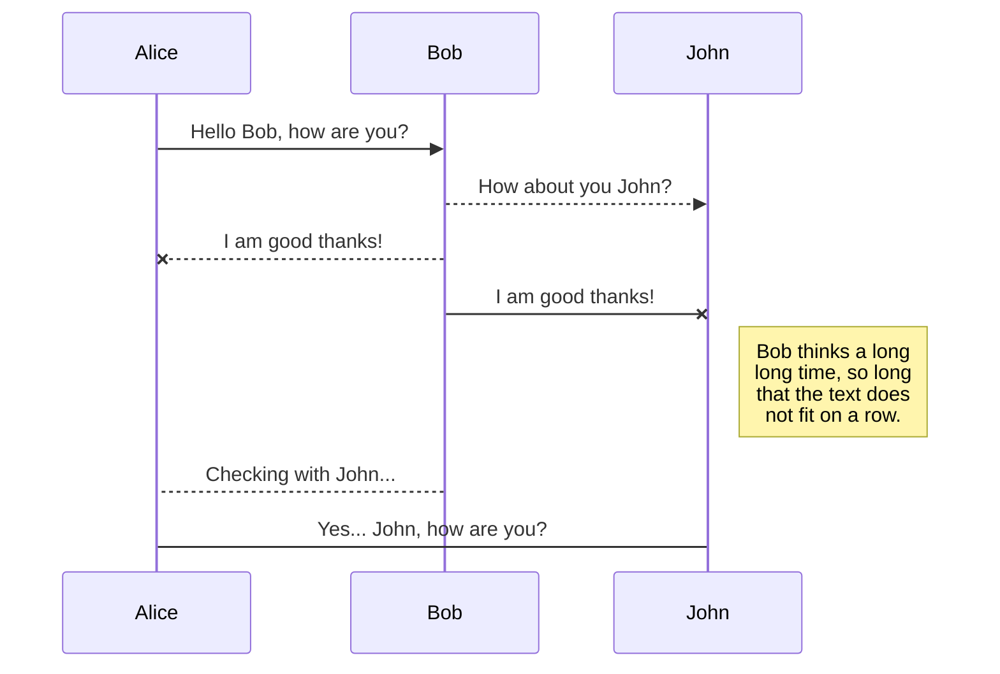
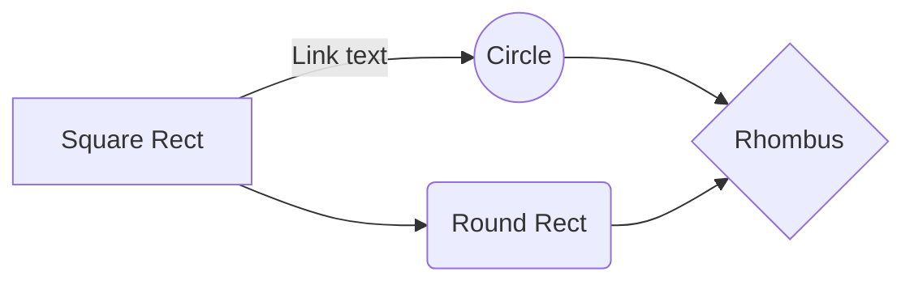

# 중국 네트워크 가속화 총정리

## 중국 사용자들이 겪는 문제점
중국을 차치하고 생각하면, 일반적인 웹사이트의 성능은 글로벌(중국 외) 평균 2초~8초 사이에 페이지가 로딩되는 것으로 확인됩니다. 그러나 중국에서의 글로벌 웹페이지의 페이지 로딩 속도, 또는 인터넷을 통한 서비스 사용 속도는 최대 4~5분이 걸리는 것으로 확인되었고 이는 전자에 비해 10배나 큰 수치입니다. 
중국에서 웹사이트 성능이 현격히 저하되는 이유는 여러가지가 있습니다.
**1) 국경간 불안정한 네트워크**
대부분의 고객들은 중국 밖(한국)에 서버를 두고 중국 내 사용자들에게 서비스하는 경우가 많습니다. 이 경우, 사용자 경험은 중국과 중국밖을 오가는 국경간 인터넷 네트워크의 영향을 크게 받습니다. 사용자와 서버 간 거리 자체가 멀기 때문에 *latency도 크고, 다수 사용자들이 공용으로 사용하는 인터넷의 특성상 인터넷 혼잡도(병목현상)에 의한 packet loss, network jitter 등으로 인해 사용자 경험이 크게 저하됩니다.
**2) 중국 내 불안정한 네트워크**
일부 고객의 경우 중국 내 서버를 두고 정식적으로 ICP filling domain을 발급받아 서비스하는 경우에도, 중국 내 불안정한 네트워크로 인해 속도 이슈를 겪습니다. 중국은 나라 자체도 크고 인구도 많아 지역을 크게 동서남북으로 나누어 다른 통신사업체들(차이나 텔레콤, 차이나 유니콤, 차이나 모바일 등)이 나누어서 관리합니다. 이때 사용자 위치에 따라 여러 통신사업체 망을 걸쳐 네트워크 경로가 형성되는 경우, 라우팅이 최적화되지 않아 속도 이슈를 야기할 수 있습니다.
**3) GFW에 의한 차단되는 컨텐츠**
국경간 네트워크를 오가는 트래픽에 관한 규제입니다. 중국 내에서는 구글, 페이스북을 비롯한 여러 컨텐츠가 아예 차단되어 있고 한국 몇몇 사이트도 사이트 전체 또는 일부가 접속 불가한 경우가 있습니다. 웹사이트에 검열되는 컨텐츠(댓글, 동영상 등)이 포함되어 있다면 해당 object들로 인해 사이트 자체가 느려질 수 있습니다.

*latency: 지연시간, 일반적으로 데이터가 목적지에 도착했다가 다시 돌아 오는 데 걸리는 시간으로 측정하고 거리에 비례하여 증가합니다.
## 중국 비즈니스를 위해 알아야 할 사항들
1) ICP 비안 도메인
중국 내 온라인(인터넷)을 통한 비즈니스를 운영할 시 필요한 절차이다. **중국 내에 IT 리소스 (서버, IP, CDN 등)**를 사용하여 **도메인**을 통해 인터넷으로 서비스를 한다면 ICP 비안 도메인은 반드시 필요합니다. 
ICP 도메인 발급은 알리바바 클라우드 콘솔을 통해 직접 신청하거나 대행업체 (알리바바 클라우드 파트너사들)을 통해 발급이 가능합니다.
2) GFW(Great Firewall)
- **대상: Border Network(중국-중국외지역)를 경유하는 모든 public traffic(port)에 대하여 규제합니다.**
- 방법: 알려진 바로는 키워드 필터링, IP 주소 블랙리스트, DNS poisioning, 패킷 검사 등을 통해 컨텐츠를 검열합니다.
3) CSL 2.0(China Security Law) 또는 MLPS2.0(China’s Multi-Level Protection Scheme)
중국에서 비즈니스를 하려면 반드시 지켜야 하는 중국 네트워크 보안법으로 중국 내 서비스 운영에 관한 보안 목록, 중국 내 발생한 데이터에 대한 해외반출 절차
4) 그외 산업별 규제
## 시나리오에 따른 가속화 방안

## Rename a file

You can rename the current file by clicking the file name in the navigation bar or by clicking the **Rename** button in the file explorer.

## Delete a file

You can delete the current file by clicking the **Remove** button in the file explorer. The file will be moved into the **Trash** folder and automatically deleted after 7 days of inactivity.

## Export a file

You can export the current file by clicking **Export to disk** in the menu. You can choose to export the file as plain Markdown, as HTML using a Handlebars template or as a PDF.

# Synchronization

Synchronization is one of the biggest features of StackEdit. It enables you to synchronize any file in your workspace with other files stored in your **Google Drive**, your **Dropbox** and your **GitHub** accounts. This allows you to keep writing on other devices, collaborate with people you share the file with, integrate easily into your workflow... The synchronization mechanism takes place every minute in the background, downloading, merging, and uploading file modifications.

There are two types of synchronization and they can complement each other:

- The workspace synchronization will sync all your files, folders and settings automatically. This will allow you to fetch your workspace on any other device.
	> To start syncing your workspace, just sign in with Google in the menu.

- The file synchronization will keep one file of the workspace synced with one or multiple files in **Google Drive**, **Dropbox** or **GitHub**.
	> Before starting to sync files, you must link an account in the **Synchronize** sub-menu.

## Open a file

You can open a file from **Google Drive**, **Dropbox** or **GitHub** by opening the **Synchronize** sub-menu and clicking **Open from**. Once opened in the workspace, any modification in the file will be automatically synced.

## Save a file

You can save any file of the workspace to **Google Drive**, **Dropbox** or **GitHub** by opening the **Synchronize** sub-menu and clicking **Save on**. Even if a file in the workspace is already synced, you can save it to another location. StackEdit can sync one file with multiple locations and accounts.

## Synchronize a file

Once your file is linked to a synchronized location, StackEdit will periodically synchronize it by downloading/uploading any modification. A merge will be performed if necessary and conflicts will be resolved.

If you just have modified your file and you want to force syncing, click the **Synchronize now** button in the navigation bar.

> **Note:** The **Synchronize now** button is disabled if you have no file to synchronize.

## Manage file synchronization

Since one file can be synced with multiple locations, you can list and manage synchronized locations by clicking **File synchronization** in the **Synchronize** sub-menu. This allows you to list and remove synchronized locations that are linked to your file.

# Publication

Publishing in StackEdit makes it simple for you to publish online your files. Once you're happy with a file, you can publish it to different hosting platforms like **Blogger**, **Dropbox**, **Gist**, **GitHub**, **Google Drive**, **WordPress** and **Zendesk**. With [Handlebars templates](http://handlebarsjs.com/), you have full control over what you export.

> Before starting to publish, you must link an account in the **Publish** sub-menu.

## Publish a File

You can publish your file by opening the **Publish** sub-menu and by clicking **Publish to**. For some locations, you can choose between the following formats:

- Markdown: publish the Markdown text on a website that can interpret it (**GitHub** for instance),
- HTML: publish the file converted to HTML via a Handlebars template (on a blog for example).

## Update a publication

After publishing, StackEdit keeps your file linked to that publication which makes it easy for you to re-publish it. Once you have modified your file and you want to update your publication, click on the **Publish now** button in the navigation bar.

> **Note:** The **Publish now** button is disabled if your file has not been published yet.

## Manage file publication

Since one file can be published to multiple locations, you can list and manage publish locations by clicking **File publication** in the **Publish** sub-menu. This allows you to list and remove publication locations that are linked to your file.

# Markdown extensions

StackEdit extends the standard Markdown syntax by adding extra **Markdown extensions**, providing you with some nice features.

> **ProTip:** You can disable any **Markdown extension** in the **File properties** dialog.

## SmartyPants

SmartyPants converts ASCII punctuation characters into "smart" typographic punctuation HTML entities. For example:

|                |ASCII                          |HTML                         |
|----------------|-------------------------------|-----------------------------|
|Single backticks|`'Isn't this fun?'`            |'Isn't this fun?'            |
|Quotes          |`"Isn't this fun?"`            |"Isn't this fun?"            |
|Dashes          |`-- is en-dash, --- is em-dash`|-- is en-dash, --- is em-dash|

## KaTeX

You can render LaTeX mathematical expressions using [KaTeX](https://khan.github.io/KaTeX/):

The *Gamma function* satisfying $\Gamma(n) = (n-1)!\quad\forall n\in\mathbb N$ is via the Euler integral

$$
\Gamma(z) = \int_0^\infty t^{z-1}e^{-t}dt\,.
$$

> You can find more information about **LaTeX** mathematical expressions [here](http://meta.math.stackexchange.com/questions/5020/mathjax-basic-tutorial-and-quick-reference).

## UML diagrams

You can render UML diagrams using [Mermaid](https://mermaidjs.github.io/). For example, this will produce a sequence diagram:

And this will produce a flow chart:

<!--stackedit_data:
eyJoaXN0b3J5IjpbLTI0MTk5MjMyOCwxNjQ3ODUxODg3LC0xMD
M3ODgxMzI1LDE4ODI1MTE2MDIsLTE4OTE3MDU1MTMsMTM3Njg3
NDUwMSw2ODY5NTIwMjQsLTEyMzk4NzMyMDMsLTE0NDY2MjIwMD
FdfQ==
-->