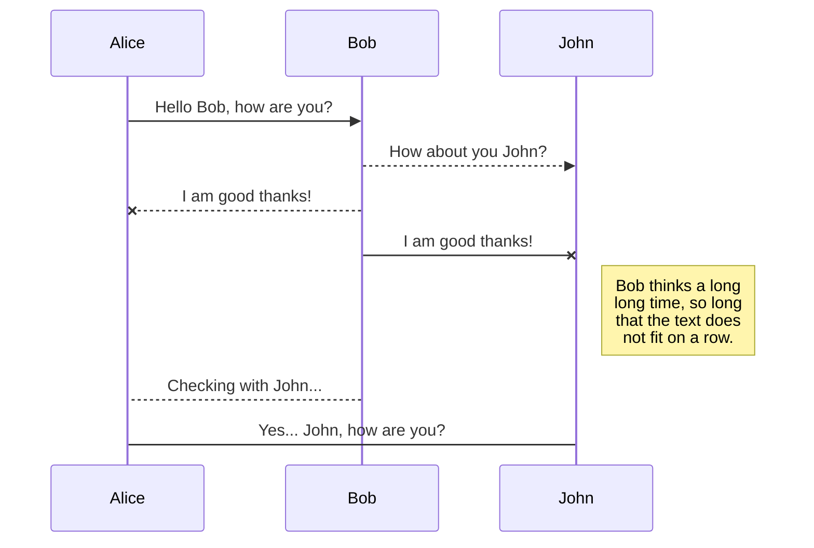
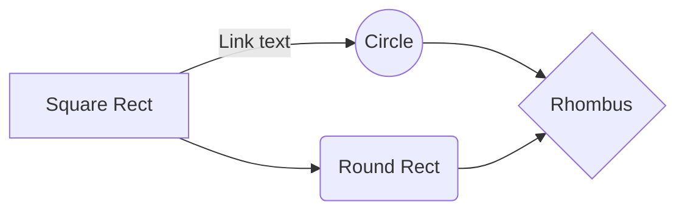

# 한중간 네트워크 가속화 총정리

## 중국 사용자들이 겪는 문제점
중국을 차치하고 생각하면, 일반적인 웹사이트의 성능은 글로벌(중국 외) 평균 2-8초 사이에 페이지가 로딩되는 것으로 확인됩니다. 그러나 중국에서의 글로벌 웹페이지의 페이지 로딩 속도, 또는 인터넷을 통한 서비스 사용 속도는 최대 4-5분이 걸리는 것으로 확인되었고 이는 전자에 비해 10배나 큰 수치입니다. 
중국에서 웹사이트 성능이 현격히 저하되는 이유는 여러가지가 있습니다.

**1) 국경간 불안정한 네트워크**

대부분의 고객들은 중국 밖(한국)에 서버를 두고 중국 내 사용자들에게 서비스하는 경우가 많습니다. 이 경우, 사용자 경험은 중국과 중국밖을 오가는 국경간 인터넷 네트워크의 영향을 크게 받습니다. 사용자와 서버 간 거리 자체가 멀기 때문에 *latency도 크고, 다수 사용자들이 공용으로 사용하는 인터넷의 특성상 인터넷 혼잡도(병목현상)에 의한 packet loss, network jitter 등으로 인해 사용자 경험이 크게 저하됩니다.

**2) 중국 내 불안정한 네트워크**

일부 고객의 경우 중국 내 서버를 두고 정식적으로 ICP filling domain을 발급받아 서비스하는 경우에도, 중국 내 불안정한 네트워크로 인해 속도 이슈를 겪습니다. 중국은 나라 자체도 크고 인구도 많아 지역을 크게 동서남북으로 나누어 다른 통신사업체들(차이나 텔레콤, 차이나 유니콤, 차이나 모바일 등)이 나누어서 관리합니다. 이때 사용자 위치에 따라 여러 통신사업체 망을 걸쳐 네트워크 경로가 형성되는 경우, 라우팅이 최적화되지 않아 속도 이슈를 야기할 수 있습니다.

**3) GFW에 의한 차단되는 컨텐츠**

국경간 네트워크를 오가는 트래픽에 관한 규제입니다. 중국 내에서는 구글, 페이스북을 비롯한 여러 컨텐츠가 아예 차단되어 있고 한국 몇몇 사이트도 사이트 전체 또는 일부가 접속 불가한 경우가 있습니다. 웹사이트에 검열되는 컨텐츠(댓글, 동영상 등)이 포함되어 있다면 해당 object들로 인해 사이트 자체가 느려질 수 있습니다.

*latency: 지연시간, 일반적으로 데이터가 목적지에 도착했다가 다시 돌아 오는 데 걸리는 시간으로 측정하고 거리에 비례하여 증가합니다.
## 중국 비즈니스를 위해 알아야 할 사항들
1) ICP 비안 도메인
중국 내 온라인(인터넷)을 통한 비즈니스를 운영할 시 필요한 절차이다. 중국 내에 IT 리소스 (서버, IP, CDN 등)를 사용하여 **도메인**을 통해 인터넷으로 서비스를 한다면 ICP 비안 도메인은 반드시 필요합니다. 
ICP 도메인 발급은 알리바바 클라우드 콘솔을 통해 직접 신청하거나 대행업체 (알리바바 클라우드 파트너사들)을 통해 발급이 가능합니다.

2) GFW(Great Firewall)
	- 대상: Border Network(중국-중국외지역)를 경유하는 모든 public traffic(port)에 대하여 규제합니다.
	- 방법: 알려진 바로는 키워드 필터링, IP 주소 블랙리스트, DNS poisioning, 패킷 검사 등을 통해 컨텐츠를 검열합니다.
	
3) CSL 2.0(China Security Law) 또는 MLPS2.0(China’s Multi-Level Protection Scheme)
중국에서 비즈니스를 하려면 반드시 지켜야 하는 중국 네트워크 보안법으로 중국 내 발생한 데이터에 대한 해외반출 절차, 개인정보 보호, 중요한 데이터에 대한 유출 방지 등에 대한 상세한 보안규제 요구사항을 담고 있습니다. 

4) 그외 산업별 규제
게임 서비스에 필요한 판호(게임·서적 등 출판물이 중국 내에서 서비스할 수 있도록 허가해주는 일종의 고유번호) 등 산업별 규제 사항은 따로 확인해주셔야 합니다. 

## 시나리오에 따른 가속화 방안

### 불특정 다수를 대상으로 하는 서비스를 자체운영하면서 ICP 도메인을 가지고 정식으로 운영하는 사이트인 경우 (1~4번)

**1. GA(Global Accelerator):** 
- 소개: 
GA는 사용자와 가장 가까운 access point로부터 origin 서버까지 알리바바 클라우드의 글로벌 백본망으로 연결하여 기존 인터넷 망에 비해 안정적이고 빠른 성능을 가져다 주는 네트워크 가속화 솔루션입니다. 사용자는 origin 서버의 IP나 도메인, 포트, 프로토콜(tcp, udp, http, https)를 등록하여 통신을 가속화할 수 있습니다. pay by traffic, pay by bandwidth 두 가지 형태로 과금됩니다.
- 사용 시나리오:
API요청/결과값 반환 처럼 작은 패킷이 오고 가는 통신을 가속화하는데에는 적합합니다. 가령, FPS, 실시간 대전류처럼 지연시간에 민감한 게임 서비스에 [GA](https://www.alibabacloud.com/help/doc-detail/153191.htm?spm=a2c63.l28256.b99.7.16d26796BlZ3CV)를 적용할 수 있습니다. 
- 고려 사항: 
GA(2021.06기준)는 한 사용자가 사용할 수 있는 대역폭이 정해져 있습니다. 따라서, 동시접속자들이 많고 트래픽이 폭팔적으로 증가하여 큰 대역폭이 확보되어야 하는 인터넷 서비스의 경우 부적합합니다. 

	GA에 대한 자세한 사항은 [GA 공식 페이지](https://www.alibabacloud.com/help/product/55629.htm?spm=a2c63.m28257.a1.89.65375922PzfQDh)를 확인해 주세요.

**2. (D)CDN:**
- 소개: 
CDN은 중국을 포함한 전 세계에 위치해 있는 알리바바의 CDN edge node들을 통해 사용자 가장 가까이 위치한 edge node에 static contents를 캐싱함으로써 웹 사이트 컨텐츠를 빠르게 전송할 수 있는 서비스입니다. 
ICP 비안이 등록된 도메인의 경우에 한하여, CDN의 mainland China(중국 내 edge) 노드를 사용하여 컨텐츠를 가속화할 수 있습니다.
API 통신, websocket 통신 처럼 캐싱할 수 없는 컨텐츠의 경우에는 DCDN(Dynamic CDN)이라고 하는 별도의 서비스를 사용하여 클라이언트-서버 간 통신 속도를 개선할 수 있습니다.
- 고려사항:
중국 내 CDN의 edge 노드를 사용하려면 반드시 ICP 비안을 발급받은 도메인이 있어야 합니다. 

	(D)CDN에 대한 자세한 사항은 [CDN 공식페이지](https://www.alibabacloud.com/help/product/27099.htm?spm=a2c63.m28257.a1.92.65375922agGuYa) 와 [DCDN 공식페이지](https://www.alibabacloud.com/help/product/64812.htm?spm=a2c63.m28257.a1.93.65375922hLueF1)를 확인해 주세요.

**3. GA + CDN**
- 소개: 위의 두가지 서비스를 합쳐 각 서비스의 한계를 상호보완할 수 있습니다. 
중국 내 CDN edge node를 사용하여 컨텐츠를 캐싱하더라도 오리진 서버는 중국 외 지역에 위치하기 때문에 국경 간 네트워크를 필터링하는 GFW 에 의해 오리진으로 부터 컨텐츠를 받아오지 못할 수 있습니다. (CDN에서 504 error 발생) 이때, CDN와 오리진 서버간 GA를 설정하여 알리바바 백본망을 타게 함으로써 이 문제를 해결할 수 있습니다.
또는, 중국 내 CDN edge 노드를 사용하더라도 CDN L2 node(서버와 가까이 위치한 CDN노드)와 오리진 서버간 인터넷 네트워크의 불안정성으로 인해 속도 저하가 있을 수 있습니다. 이 경우에도 CDN과 GA를 함께 사용하여 문제를 해결할 수 있습니다. 
[CDN+GA의 자세한 설정 절차](https://www.alibabacloud.com/help/doc-detail/176807.htm?spm=a2c63.p38356.b99.79.163d77006NSBRv)를 클릭하여 자세한 내용을 확인하시기 바랍니다.
- 고려사항: 
CDN과 GA 두 개의 서비스가 들어가기 때문에 비용이 증가합니다.
또한, CDN과 오리진 서버 간 트래픽이 증가함에 따라 GA가 병목구간이 될 수 있습니다. pay by traffic을 통한 과금을 선택하더라도 내부적으로 대역폭 할당에 제한을 걸어 놓기 때문에, 미리 그 제한을 풀어 병목현상의 위험을 줄여야 합니다.  

**4. Chinafy**
- 소개: 
Chinafy는 알리바바 클라우드의 파트너 솔루션으로 동일한 웹사이트의 중국 버전을 생성하여 중국 사용자로 하여금 속도 개선 효과를 가져다 주는 솔루션입니다. 
웹사이트의 url만 Chinafy 팀에게 전달해주면 Chinafy팀은 기존 사이트를 기반으로 웹 사이트와 웹 애플리케이션을 중국에 맞게 재 설계하는 SaaS 기반 플랫폼입니다. 고객이 해당 솔루션을 채택할 경우, DNS 레코드 변경(Chinafy 에서 제공해주는 cname으로 dns record 변경, 또는 고객이 사용하는 DNS의 지역기반 라우팅 기능을 사용해도 됨)을 통해 기존 사이트와 통합합니다. 
Chinafy는 웹사이트에 포함된 다양한 3rd party component(비콘, 구글맵, 동영상 등)을 중국 내에서 성능저하 없이 수용할 수 있는 형태로 변경하는 등 중국에 맞는 최적화 작업을 수행합니다.

- 고려사항: 
Chinafy는 대부분 static contents에 한하여 가속화합니다. 따라서 동적 요청의 경우 GA나 DCDN을 통해 보완해야 합니다. 

	자세한 사항은 [알리바바 클라우드 마켓플레이스의 Chinafy](https://marketplace.alibabacloud.com/products?keywords=chinafy&pageIndex=1)페이지를 확인하시기 바랍니다.

### 불특정 다수를 대상으로 하는 서비스 중 자체운영하면서 ICP 비안 도메인을 가지고 있지 않은 경우, 또는 비안 발급이 빠른 시일 내에 예정되어 있지 않은 경우 (6~7번)

**6. GA**
- 소개
[GA](https://www.alibabacloud.com/help/doc-detail/153189.htm?spm=a2c63.p38356.b99.5.1d21c2427iMI9g)에 대한 자세한 사항은 위의 1번 설명을 참고하시기 바랍니다. 6번의 경우 ICP 비안을 받은 도메인이 없기 때문에 중국내 가속화 IP를 사용할 수 없습니다. 대신, 홍콩의 가속화 IP를 경유하여 네트워크 속도 및 품질을 개선할 수 있습니다. 자세한 사항은 [GA 설정 가이드](https://www.alibabacloud.com/help/doc-detail/155066.htm?spm=a2c63.p38356.b99.17.166c2e243Uwsg1)를 참조해 주시기 바랍니다.
- 고려사항
국경간 인터넷 네트워크를 거치기 때문에 GFW로 인해 컨텐츠가 차단될 수 있습니다. 이를 해결하려면 정식적인 절차, 즉  ICP비안 발급을 고려해 주셔야 합니다.

**7. Chinafy**
- 소개
[Chinafy](https://marketplace.alibabacloud.com/products?keywords=chinafy&pageIndex=1)는 ICP 발급받지 않은 도메인도 가속화할 수 있습니다. 자세한 사항은 4번 설명을 참조해 주시기 바랍니다.

- 고려사항
7번 또한 국경간 인터넷 네트워크를 거치기 때문에 GFW로 인해 컨텐츠가 차단될 수 있습니다. 이를 해결하려면 정식적으로 ICP비안 도메인을 발급받아야 합니다.

### 특정 다수를 대상으로 하는 서비스 중 자체 운영하는 웹사이트를 사내망을 통해 접속해야 하는 경우 (9~10번)
**9. VPN + GA**
기존에 사용하던 VPN 장비가 있으면 GA와 연동하여 가속화할 수 있습니다. 
1) VPN 장비 설정에서 NAT-T(Nat Traversal)기능을 enable
2) GA 설정에서 나온 accelerated IP와 endpoint ip를 각 장비의 remote gateway IP로 설정 (endpoint group ip가 4개가 나오기 때문에 하나의 IP로 합치는 작업 필요, 알리바바 클라우드 백앤드 작업 필요)
3) IPSec connection 설정 시 passive mode로 터널링

	

**10. SAG + CEN**

SAG는 알리바바 클라우드의 SDWAN 솔루션으로 알리바바의 글로벌 백본망을 기반으로 암호화된 레이어(VPN)를 구성하여 안정적으로 빠른 사내망 구축을 돕는 서비스입니다. 일반 VPN이 인터넷 공용망을 기반으로 하여 많은 성능 이슈를 겪는 반면, SAG는 한중간 VPN을 구성하더라도 속도나 끊김 문제 없이 안정적인 성능을 제공합니다. 
중국 내 사무실 또는 지점에 [SAG device(하드웨어)](https://www.alibabacloud.com/help/doc-detail/69232.htm?spm=a2c63.p38356.b99.123.41dd3527CdLSL3)나  [vCPE(서버 설치용 소프트웨어)](https://www.alibabacloud.com/help/doc-detail/182147.htm?spm=a2c63.p38356.b99.134.ee94513afzkjLn)를 설치하여 운영하거나, 사용자 단말기(모바일, PC)에 [SAG app](https://www.alibabacloud.com/help/doc-detail/108541.htm?spm=a2c63.p38356.b99.139.a2365d49pVQD5E)을 설치하여 가속화할 수 있습니다.

**선택 시 고려사항**

9번(GA+VPN)은 기본 장비를 그대로 활용할 수 있는 반면, 문제 발생 시 GA와 VPN의 통합 모니터링이 불가하여 원인 분석을 위한 모니터링/로그를 각각 봐야합니다.
10번(SAG+CEN)은 하드웨어나, 서버 설치용 SW를 새로 구성해야하지만 , SAG 단일 콘솔에서 장비/트래픽에 대한 통합 모니터링 및 알람 설정이 가능하고 QoS(애플리케이션에 따른 대역폭 throttling 설정), 장비 및 link 단의 HA 구성 등 SAG의 장점을 누릴 수 있습니다.

### 특정 다수를 대상으로 하는 서비스를 자체운영하면서 사내망을 사용하지 않는 경우
12. GA(중국 가속화 IP사용) + pac
13. GA(홍콩 가속화 IP사용)

### 특정 다수를 대상으로 하는 서비스를 자체운영하지 않고 SaaS와 같은 3rd party platform을 사용하는 경우
- 소개: 
- 다이어그램:

	

- [자세한 셋업 가이드](https://github.com/rnlduaeo/alibaba/blob/master/SaaS%20acceleration%20for%20Korea.md)는 클릭해서 확인해 주세요. 

총 3가지로 정리될 것 같습니다. 적어 놓고 보니 메가존 입장에서는 1 > 3> 2 번 순으로 관리적 측면에서 가장 안전한 선택이 될 것 같습니다.
아래 사항으로 콜 시 논의 하면 되겠습니다.

1) GA + fortinet proxy
1-1) 데이터 플로우: fortinet client (mobile, pc) -> GA -> ECS(fortinet proxy) -> salesforce
1-2) 견적: GA(basic + crossborder, instance) + fortinet marketplace image: 구식은 444.8 usd/month, 신식은 532.9 + EIP
fortinet obsolete: https://marketplace.alibabacloud.com/products/56700005/Fortinet_FortiGate_PAYG_NGFW_HA_Supported_-sgcmjj024463.html
fortinet new generation: https://marketplace.alibabacloud.com/products/56700005/Fortinet_em_FortiGate_em_PAYG_Next_Generation_Firewall_2_vCPUs_-sgcmjj00024896.html?spm=a3c0i.730005.0.0.5a6a2faahXG6LY&innerSource=search_fortigate#support
1-3) 장점: fortigate의 기술 서포트를 받을 수 있고 HA 구성 가능(ha 구성시 비용 증가)
1-4) 단점: 가격 증가

2) SAG + CEN + privatezone + nginx proxy
2-1) 데이터 플로우: sag app(mobile, pc) -> privatezone -> ccn -> cen -> slb -> ecs(2개, nginx forward proxy) -> salesforce
위의 slb+ecs2개 를 eci로 바꾸어도 무방 
2-2) 견적: sag app + cen + ecs + slb + privatezone
2-3) 장점: HA 가능, SAG 관련 알리바바 지원 받을 수 있음 
2-4) 단점: 복잡한 구성, 문제시 원인 파악 힘듦, SAG client 개수에 따라 추가요금, SAG app instance가 한개 당 1000명까지 지원 가능, 추가인원은 추가 SAG app instance 구매 해야 함. SAG app client 5Gbps넘으면 추가 과금 됨 

3) GA + squid proxy 
3-1) 데이터 플로우: pac(mobile, pc) -> GA -> squid -> salesforce
3-2) 견적: GA(basic, crossborder, instance) + ecs + eip
3-3) 장점: 간편한 구성, client 증가에 따른 추가 요금 없음
3-4) 단점: squid 관리 포인트, pac관리 포인트(포인트)

## Rename a file

You can rename the current file by clicking the file name in the navigation bar or by clicking the **Rename** button in the file explorer.

## Delete a file

You can delete the current file by clicking the **Remove** button in the file explorer. The file will be moved into the **Trash** folder and automatically deleted after 7 days of inactivity.

## Export a file

You can export the current file by clicking **Export to disk** in the menu. You can choose to export the file as plain Markdown, as HTML using a Handlebars template or as a PDF.

# Synchronization

Synchronization is one of the biggest features of StackEdit. It enables you to synchronize any file in your workspace with other files stored in your **Google Drive**, your **Dropbox** and your **GitHub** accounts. This allows you to keep writing on other devices, collaborate with people you share the file with, integrate easily into your workflow... The synchronization mechanism takes place every minute in the background, downloading, merging, and uploading file modifications.

There are two types of synchronization and they can complement each other:

- The workspace synchronization will sync all your files, folders and settings automatically. This will allow you to fetch your workspace on any other device.
	> To start syncing your workspace, just sign in with Google in the menu.

- The file synchronization will keep one file of the workspace synced with one or multiple files in **Google Drive**, **Dropbox** or **GitHub**.
	> Before starting to sync files, you must link an account in the **Synchronize** sub-menu.

## Open a file

You can open a file from **Google Drive**, **Dropbox** or **GitHub** by opening the **Synchronize** sub-menu and clicking **Open from**. Once opened in the workspace, any modification in the file will be automatically synced.

## Save a file

You can save any file of the workspace to **Google Drive**, **Dropbox** or **GitHub** by opening the **Synchronize** sub-menu and clicking **Save on**. Even if a file in the workspace is already synced, you can save it to another location. StackEdit can sync one file with multiple locations and accounts.

## Synchronize a file

Once your file is linked to a synchronized location, StackEdit will periodically synchronize it by downloading/uploading any modification. A merge will be performed if necessary and conflicts will be resolved.

If you just have modified your file and you want to force syncing, click the **Synchronize now** button in the navigation bar.

> **Note:** The **Synchronize now** button is disabled if you have no file to synchronize.

## Manage file synchronization

Since one file can be synced with multiple locations, you can list and manage synchronized locations by clicking **File synchronization** in the **Synchronize** sub-menu. This allows you to list and remove synchronized locations that are linked to your file.

# Publication

Publishing in StackEdit makes it simple for you to publish online your files. Once you're happy with a file, you can publish it to different hosting platforms like **Blogger**, **Dropbox**, **Gist**, **GitHub**, **Google Drive**, **WordPress** and **Zendesk**. With [Handlebars templates](http://handlebarsjs.com/), you have full control over what you export.

> Before starting to publish, you must link an account in the **Publish** sub-menu.

## Publish a File

You can publish your file by opening the **Publish** sub-menu and by clicking **Publish to**. For some locations, you can choose between the following formats:

- Markdown: publish the Markdown text on a website that can interpret it (**GitHub** for instance),
- HTML: publish the file converted to HTML via a Handlebars template (on a blog for example).

## Update a publication

After publishing, StackEdit keeps your file linked to that publication which makes it easy for you to re-publish it. Once you have modified your file and you want to update your publication, click on the **Publish now** button in the navigation bar.

> **Note:** The **Publish now** button is disabled if your file has not been published yet.

## Manage file publication

Since one file can be published to multiple locations, you can list and manage publish locations by clicking **File publication** in the **Publish** sub-menu. This allows you to list and remove publication locations that are linked to your file.

# Markdown extensions

StackEdit extends the standard Markdown syntax by adding extra **Markdown extensions**, providing you with some nice features.

> **ProTip:** You can disable any **Markdown extension** in the **File properties** dialog.

## SmartyPants

SmartyPants converts ASCII punctuation characters into "smart" typographic punctuation HTML entities. For example:

|                |ASCII                          |HTML                         |
|----------------|-------------------------------|-----------------------------|
|Single backticks|`'Isn't this fun?'`            |'Isn't this fun?'            |
|Quotes          |`"Isn't this fun?"`            |"Isn't this fun?"            |
|Dashes          |`-- is en-dash, --- is em-dash`|-- is en-dash, --- is em-dash|

## KaTeX

You can render LaTeX mathematical expressions using [KaTeX](https://khan.github.io/KaTeX/):

The *Gamma function* satisfying $\Gamma(n) = (n-1)!\quad\forall n\in\mathbb N$ is via the Euler integral

$$
\Gamma(z) = \int_0^\infty t^{z-1}e^{-t}dt\,.
$$

> You can find more information about **LaTeX** mathematical expressions [here](http://meta.math.stackexchange.com/questions/5020/mathjax-basic-tutorial-and-quick-reference).

## UML diagrams

You can render UML diagrams using [Mermaid](https://mermaidjs.github.io/). For example, this will produce a sequence diagram:

And this will produce a flow chart:

<!--stackedit_data:
eyJoaXN0b3J5IjpbLTE4ODI5NzIzNjUsMTQwMTYzNTY0MCwxMT
A1NTUxMjkyLDE2NjEwNzY0NTUsMjc4NDI4ODA3LC0xMDkzNDQ2
MjY4LDM4ODg1NTQ2MywtMTY0NDQ3MjQ4MywtMTI4Nzk0MTYyMi
wyMDkwMTY0NzgsLTE2MTI3Nzg2OSwtMTAyODMyOTIwMSwtODMw
MDk3NzEzLDgxOTI5MjU4NSwtMTQwNDc0MDE1NywxMTA2MzY5Mz
MsOTg4NjExMjkwLC04NDU1MjI3NDQsMTcyMDcwMzU2NywxOTI5
NjI5NTA0XX0=
-->
<!--stackedit_data:
eyJoaXN0b3J5IjpbLTExMDEzMTg1MTUsNDI0NzM2Mjg3LC0xMz
ExODc1MjE0XX0=
-->